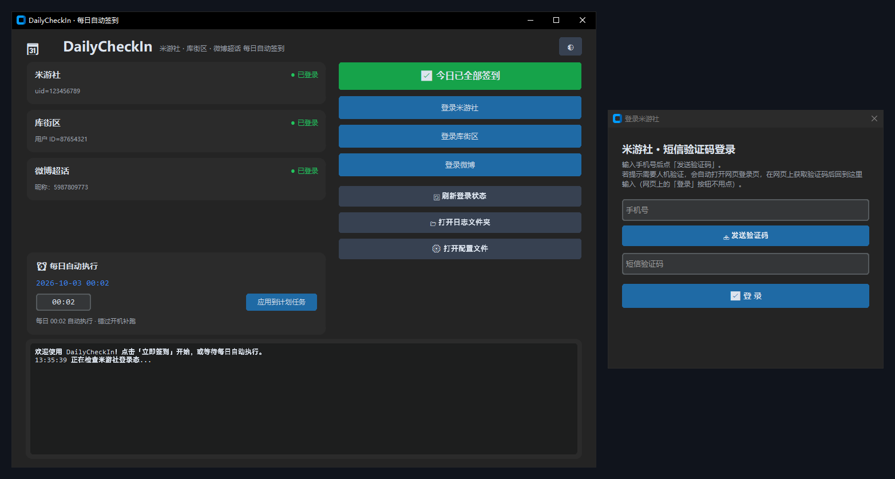

<div align="center">

# 🗓️ DailyCheckIn

**米游社 & 库街区 · 每日自动打卡签到小工具**

*零抓包 · 单文件 · 挂上就不用管*

[](https://www.python.org/)
[](README.md)
[](LICENSE)
[](https://github.com/Maratrain/DailyCheckIn/stargazers)

</div>

---

## ✨ 功能一览

| 平台 | 功能 | 说明 |
|:---:|---|---|
| 🌈 **米游社** | 米游币打卡 | 多分区打卡（原神 / 星穹铁道 / 绝区零等，可配置），自动统计米游币收益 |
| 🌈 **米游社** | 游戏签到领福利 | 原神、崩坏：星穹铁道、绝区零、崩坏3，自动识别全部已绑定角色并签到，播报当日奖励 |
| 🔴 **库街区** | 每日补给签到 | 鸣潮、战双帕弥什，自动识别绑定角色，播报签到奖励 |
| 🟠 **微博** | 超话签到 | 自动签到**你关注的全部超话**（含原神超话），逐个播报结果 |

**特点：**

- 🔐 **零抓包** —— 米游社用短信验证码 / App 扫码登录，库街区用短信验证码登录，全程不需要 Charles/Fiddler
- 🖥️ **可选图形界面** —— 深色桌面 GUI（CustomTkinter），状态卡片 + 一键签到 + 登录弹窗 + 实时日志，**每日自动执行时间可在界面里直接改**
- 📦 **单文件核心** —— `checkin.py` 一个文件搞定签到，除 `requests` 外零第三方依赖（RSA 加密为纯标准库实现）
- ⏰ **双保险定时** —— Windows 计划任务每天定时执行 + 开机自启补跑；错过补跑（`StartWhenAvailable`），电脑没开机也不漏签
- 🧷 **已签状态记录** —— 当日确认签到后写入本地状态（`state.json`），同一天再运行直接跳过，一个请求都不发
- 🔄 **自动续期** —— 米游社 cookie_token 过期自动用 stoken 续期，长期免维护
- 📝 **中文日志** —— 每一步都有进度提示，按天写入 `logs/`

## 📸 运行效果

```log
════ 每日打卡签到开始（2026-09-27 00:26:28）════
正在米游币打卡 [原神]...
米游币打卡 [原神]：成功
正在米游币打卡 [崩坏：星穹铁道]...
米游币打卡 [崩坏：星穹铁道]：成功
米游币：今日已获得 40，还可获取 0，当前共 29865
正在检查 原神 签到...
原神 [拾柒]：今日已签到，奖励「精锻用良矿」x5
正在处理库街区 鸣潮 每日补给...
库街区 鸣潮 [拾柒]：每日补给签到成功，奖励：中级能源核心
══════════════ 执行汇总 ══════════════
  米游社：完成
  库街区：完成
```

## 🖥️ 图形界面预览

<div align="center">

<p><sub>左：主界面（登录状态 · 一键签到 · 每日时间设置）　右：短信验证码登录弹窗</sub></p>
</div>

## 🚀 快速开始

### 1️⃣ 安装依赖

```bash
pip install -r requirements.txt
```

> 仅用命令行的话 `pip install requests` 即可；要用图形界面需额外装 `customtkinter`（`requirements.txt` 已统一包含）。

### 2️⃣ 登录（每个平台只需一次）

**图形界面**（推荐）：双击 `启动界面.bat`（或 `python gui.py`）→ 点「登录米游社 / 登录库街区」→ 在弹窗里输入手机号获取验证码登录。

**命令行**：

```bash
python checkin.py login
```

| 平台 | 方式 |
|---|---|
| **米游社** | ① 短信验证码登录（**推荐**，全部功能可用）；② App 扫码（⚠️ 2026-09 起米哈游限制了扫码 token 的米游社接口权限，仅游戏签到可用） |
| **库街区** | 工具自动打开官网 → 右上角「登录」→ 弹窗内获取短信验证码（网页上的「登录」按钮不用点）→ 把验证码输回命令行 |
| **微博** | 点「登录微博」→「自动获取 Cookie」→ 工具打开浏览器（系统自带 Edge），在页面中登录微博后**自动抓取保存**，无需手动复制；也可手动粘贴 Cookie 兜底 |

### 3️⃣ 挂上定时任务

双击 **`install_task.bat`** 即完成注册：

- 🕛 每天 **00:02** 自动执行（改时间：图形界面里选好时分点「应用」即可；或编辑 bat 里的 `/ST 00:02` 后重新双击）
- 💻 **开机自启补跑** + **错过补跑**：电脑没开机 / 在睡眠，下次开机可用时立刻补签
- 签到接口天然幂等，重复执行只会提示「已签到」，绝不重复领取

### 4️⃣ 常用命令

```bash
python checkin.py        # 手动执行一次今日签到
python checkin.py test   # 只查询登录状态，不执行签到
python checkin.py login  # 重新登录（凭证过期时用）
```

## ⚙️ 配置说明

`config.json` 首次运行自动生成，登录凭证由 `login` 命令写入，一般只需关心这几项：

```jsonc
{
  "mihoyo": {
    "bbs_gids": ["2", "6", "8"],        // 米游币打卡分区：1崩坏3 2原神 6星穹铁道 8绝区零
    "game_sign": ["genshin", "honkaisr", "zzz"]  // 游戏签到，可加 "honkai3rd"
  },
  "kuro": {
    "games": ["wuwa", "pgr"]            // 库街区每日补给：鸣潮 / 战双帕弥什
  }
}
```

## ❓ 常见问题

<details>
<summary><b>米游币打卡提示「触发风控验证码」（retcode 1034）</b></summary>
米哈游对部分环境风控较严，当天在米游社 App 里手动点一次打卡即可，游戏签到一般不受影响。
</details>

<details>
<summary><b>运行时卡住不动</b></summary>
① 检查是否在 cmd 里点过鼠标——Windows「快速编辑」模式会冻结程序输出，按 <code>Esc</code> 恢复；② 本工具默认忽略系统代理直连国内接口，如你的网络必须走代理，在 <code>config.json</code> 加 <code>"proxy": "http://127.0.0.1:端口"</code>。
</details>

<details>
<summary><b>提示 token / stoken 已过期</b></summary>
重新执行 <code>python checkin.py login</code> 登录一次即可。米游社 cookie_token 过期会自动续期，无需理会。
</details>

<details>
<summary><b>改了签到时间但没生效</b></summary>
图形界面里选好时分点「应用」即改即生效；若用 bat 方式，要编辑其中的 <code>/ST 00:02</code> 参数（注意不是下方提示文案），然后重新双击运行。
</details>

<details>
<summary><b>微博超话签到提示 Cookie 失效</b></summary>
微博网页登录态一般可维持数月。失效后重新点「登录微博」→「自动获取 Cookie」：浏览器配置文件保存在 <code>weibo_profile/</code>，只要之前登录态没过期就会直接自动完成、连登录都免了。
</details>

<details>
<summary><b>想强制重新签到怎么办</b></summary>
正常情况下当天确认签到后会记入 <code>state.json</code>，再次运行直接跳过。若想强制重跑（例如白天新绑定了游戏角色），删除目录下的 <code>state.json</code> 再运行即可。
</details>

## 📁 项目结构

```
DailyCheckIn/
├── checkin.py          # 签到核心（命令行入口，单文件）
├── gui.py              # 图形界面（CustomTkinter 深色主题）
├── config.json         # 配置与登录凭证（自动生成，已 gitignore）
├── requirements.txt    # 依赖清单
├── install_task.bat    # 注册每日计划任务
├── uninstall_task.bat  # 移除计划任务
├── 启动界面.bat         # 双击打开图形界面
├── docs/               # README 图片资源
└── logs/               # 按天滚动的运行日志
```

## 🧩 致谢

接口实现参考并感谢以下现网维护的开源项目：

- [Womsxd/MihoyoBBSTools](https://github.com/Womsxd/MihoyoBBSTools) —— 米游社签到与 DS 签名体系
- [Marchen-orz/MiyoQian](https://github.com/Marchen-orz/MiyoQian) —— passport 专用兑换接口、`x-rpc-signgame` 请求头
- [mxyooR/Kuro-autosignin](https://github.com/mxyooR/Kuro-autosignin) · [mxyooR/Kuro_login](https://github.com/mxyooR/Kuro_login) —— 库街区签到与短信登录
- [starudream/sign-task](https://github.com/starudream/sign-task) —— stoken 渠道作用域问题定位
- [MR-LIYA/MHY_Scanner](https://github.com/MR-LIYA/MHY_Scanner) —— 米哈游 passport 短信登录与 RSA 实现
- [swtmaxx/weibo-auto-checkin](https://github.com/swtmaxx/weibo-auto-checkin) —— 微博 m.weibo.cn 超话容器接口与 st 验签流程

## ⚠️ 免责声明

本项目仅供个人学习交流使用，请勿用于商业用途或批量账号操作。请合理控制请求频率，因使用本工具造成的任何账号问题由使用者自行承担。

## 📄 License

[MIT](LICENSE) © 2026 Maratrain
